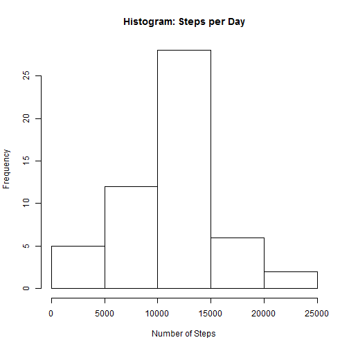
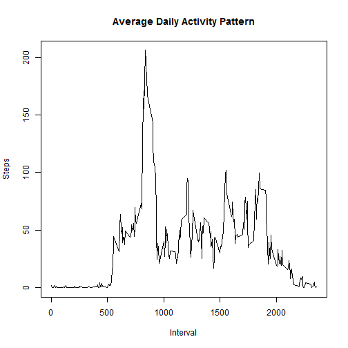
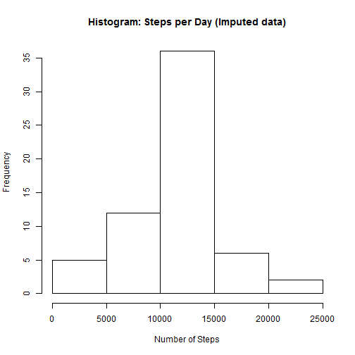
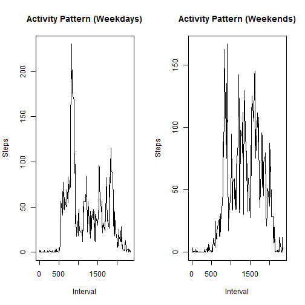

```r
---
title: 'Coursera: Reproducible Research - Project 1'
author: "Mark Long"
date: "February 9, 2017"
output: html_document
---


# Load Activity Monitoring Data
```

```
## Error: <text>:11:0: unexpected end of input
## 9: # Load Activity Monitoring Data
## 10: 
##    ^
```

```r
activity <- read.csv("activity.csv", header = TRUE)
```


# Q1 - What is mean total number of steps taken per day?

## Calculate the total number of steps taken per day

```r
StepsPerDay <- tapply(activity$steps, activity$date, sum)
```

## Make a histogram of the total number of steps taken each day

```r
hist(StepsPerDay, xlab = "Number of Steps", main = "Histogram: Steps per Day")
```



## Calculate and report the mean and median of the total number of steps taken per day

```r
MeanPerDay <- mean(StepsPerDay, na.rm = TRUE)
MedianPerDay <- median(StepsPerDay, na.rm = TRUE)
```
The mean and median number of steps per day are 1.0766189 &times; 10<sup>4</sup> and 10765, respectively.


# Q2 - What is the average daily activity pattern?

## Make a time series plot of the 5-minute interval and the average number of steps taken, averaged across all days

```r
StepsPerInterval <- tapply(activity$steps, activity$interval, mean, na.rm = TRUE)
plot(as.numeric(names(StepsPerInterval)), 
     StepsPerInterval, 
     xlab = "Interval", 
     ylab = "Steps", 
     main = "Average Daily Activity Pattern", 
     type = "l")
```



## Which 5-minute interval, on average across all the days in the dataset, contains the maximum number of steps?

```r
maxInterval <- names(sort(StepsPerInterval, decreasing = TRUE)[1])
maxSteps <- sort(StepsPerInterval, decreasing = TRUE)[1]
```
The interval associated with maximum activity is interval 835, at 206.1698113 steps


# Q3 - Imputing missing values

## Calculate and report the total number of missing values in the dataset

```r
NA.vals <- sum(is.na(activity$steps))
```
There are 2304 missing values in this data set

## Devise a strategy for filling in all of the missing values in the dataset.
I will fill in missing data with the mean number of steps across all days with available data for that particular interval.

## Create a new dataset that is equal to the original dataset but with the missing data filled in.

```r
StepsPerInterval <- tapply(activity$steps, activity$interval, mean, na.rm = TRUE)
# split activity data by interval
activity.split <- split(activity, activity$interval)
# fill in missing data for each interval
for(i in 1:length(activity.split)){
    activity.split[[i]]$steps[is.na(activity.split[[i]]$steps)] <- StepsPerInterval[i]
}
activity.imputed <- do.call("rbind", activity.split)
activity.imputed <- activity.imputed[order(activity.imputed$date) ,]
```

## Make a histogram of the total number of steps taken each day and Calculate and report the mean and median total number of steps taken per day.

```r
StepsPerDay.imputed <- tapply(activity.imputed$steps, activity.imputed$date, sum)
hist(StepsPerDay.imputed, xlab = "Number of Steps", main = "Histogram: Steps per Day (Imputed data)")
```



```r
MeanPerDay.imputed <- mean(StepsPerDay.imputed, na.rm = TRUE)
MedianPerDay.imputed <- median(StepsPerDay.imputed, na.rm = TRUE)
```
The mean and median number of steps per day including imputed data are 1.0766189 &times; 10<sup>4</sup> and 1.0766189 &times; 10<sup>4</sup>, respectively. The mean remains the same as prior to imputation, while the median value increased slightly.


# Q4 - Are there differences in activity patterns between weekdays and weekends?

## Create a new factor variable in the dataset with two levels - "weekday" and "weekend" indicating whether a given date is a weekday or weekend day.

```r
activity.imputed$day <- ifelse(weekdays(as.Date(activity.imputed$date)) == "Saturday" | weekdays(as.Date(activity.imputed$date)) == "Sunday", "weekend", "weekday")
```

## Make a panel plot containing a time series plot of the 5-minute interval and the average number of steps taken, averaged across all weekday days or weekend days. 

```r
# Calculate average steps per interval for weekends
StepsPerInterval.weekend <- tapply(activity.imputed[activity.imputed$day == "weekend" ,]$steps, activity.imputed[activity.imputed$day == "weekend" ,]$interval, mean, na.rm = TRUE)

# Calculate average steps per interval for weekdays
StepsPerInterval.weekday <- tapply(activity.imputed[activity.imputed$day == "weekday" ,]$steps, activity.imputed[activity.imputed$day == "weekday" ,]$interval, mean, na.rm = TRUE)

# Set a 2 panel plot
par(mfrow=c(1,2))

# Plot weekday activity
plot(as.numeric(names(StepsPerInterval.weekday)), 
     StepsPerInterval.weekday, 
     xlab = "Interval", 
     ylab = "Steps", 
     main = "Activity Pattern (Weekdays)", 
     type = "l")

# Plot weekend activity
plot(as.numeric(names(StepsPerInterval.weekend)), 
     StepsPerInterval.weekend, 
     xlab = "Interval", 
     ylab = "Steps", 
     main = "Activity Pattern (Weekends)", 
     type = "l")
```


```

